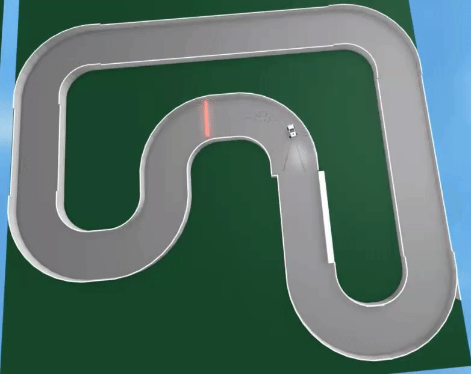
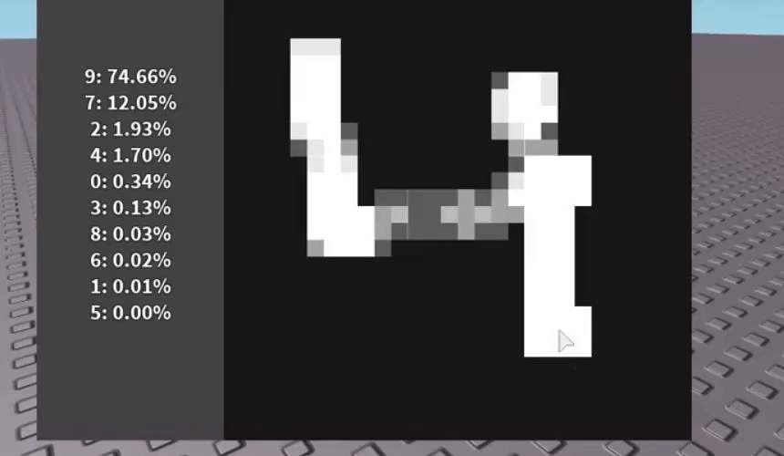
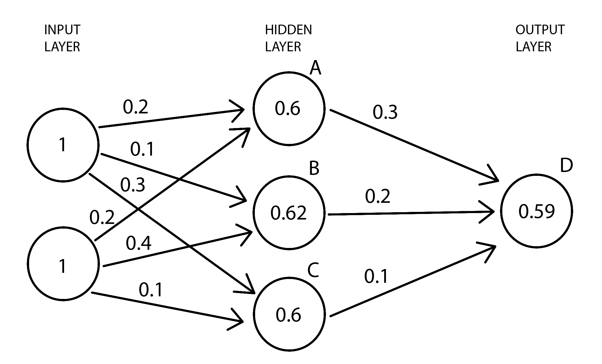

# Introduction

### Why machine learning?
Machine learning concepts allow for programmers to solve problems that are either too difficult to code manually, or are too obscure to figure out.  
Most famous examples of this are self-driving vehicles, bots, text to speech (and visa-versa), physics simulations (for mass scale use where normal simulation is too slow), adaptive animations, image generation, facial recognition, terrain generation, and hundreds of more.  
All of these are either impossible without machine learning or are greatly enhanced by it. 

### Roblox Examples
 
[ScriptOn](https://devforum.roblox.com/u/scripton/summary)'s [early attempts](https://www.reddit.com/r/roblox/comments/7t3a58/i_made_a_neural_network_ai_car_that_can_drive/) on self driving cars.  
 
ScriptOn's [later attempts/successes](https://devforum.roblox.com/t/self-driving-neural-network-cop-cars/190323) on self driving cars.  
 
Badcc's [MNIST recognition](https://www.youtube.com/watch?v=O7mNPUyFY7U).  
 
Though not Roblox related, it would be a travesty to not include [AlphaStar](https://deepmind.com/blog/article/alphastar-mastering-real-time-strategy-game-starcraft-ii), the Starcraft 2 AI that defeated pro players (which uses the new type of network I researched for this library, LSTMs).

### Why make the library?
Roblox is the perfect platform for young programmers to begin their careers (as well as further them with DevEx).  Slowly but surely fundamental concepts like
Object Orientated Programming (OOP) become more and more popular among the community and more newbies get to learn them. 
Unfortunately, this development seems to have missed the programming concept with arguably the most potential and impact on our present and future lives: Machine Learning.   
The ability to teach a program to adapt to it's circumstances and act to survive or otherwise achieve it's main goal on it's own. This is achieved with a concept
called "neural networks", a network of individual nodes or neurons that work independently to bring the network to life, much like neurons in our brains.  
The problem is that machine learning is typically seen as something for experienced programmers or good mathematicians, things that the overwhelming majority of
all programmers are not (yet).  
Machine learning is extremely undeveloped on Roblox and has no universal implementation on Roblox: only attempts and developers playing around on their own. 
After taking an interest in the concept myself, I spent a good half of a year researching neural networks and how they function, 
mostly because there are extremely few proper materials that explain things in an understandable jargon or manner. During my self-education, I wrote my first
neural network library. It is extremely rough and unprofessionally done due to my lack of experience, and, though successful, is still an embarassment to me.  
After learning OOP and writing my own implementation for it in Lua, I began working on my second neural network library. After spending a good few months researching
an entirely different type of network, I am left with a much better design that is actually user friendly and readable. 

### How do neural networks work?
All basic neural networks (NN) are just an assembly of nodes that are somehow plugged into each other for communication. 
The most common and simple network type is the feedforward network, also called a multilayer perceptron but that is irrelevant.

As you can see, most networks, like the feedforward above, sort their nodes into layers. Most networks have 3 layer types: 
The input layer, the hidden layer(s), and the output layer.  
Each layer is an array of nodes, with nodes from one layer connecting to nodes in the next layer using connections called 'synapses'. 
Before we get to the layer types, we need to understand individual nodes. Each basic node consists of a set of 'weights', a 'bias', and an 'activation function'.
Every synapse that connects to the node on the input (left, in this case) side carries the previous node's output. This output is then multiplied by the weight associated with the synapse. If the node's output is 0.6, and the weight associated with it is 0.1, than the product will be 0.06. This operation is done on every synapse connected to the node in question. Once all of these products are calculated, they are summed up along with the node's bias, a single number that regulates the node's activity positively or negatively. 
This sum is almost ready to be the node's output. However, we have a problem: this sum is not scaled. It can be either really low, or really high, which can cause serious problems in the network down the line. This regulate this sum, an activation function is used. This function is supposed to take in this sum and convert it into a managable number, like 0 to 1. This number then becomes the node's output, which is then propagated to the next node down the line. 
The most well known activation function is the sigmoid, though ReLU is the most popular and accepted.  
Now, what are these layer types? The first layer is always the input layer. The input layer is made up of special input nodes that are like normal nodes, expect they do not have any synapses, weights, bias, or activation functions. The only thing they have is an output, given to them at the start of propagation by the user; an input to the network. 
The hidden layers are the normal nodes discussed earlier. They are the core of the network's processing. The reason they are 'hidden' is because the manner of processing is that of a black box; you can feed it an input and recieve an output, but you have no way of understanding how it got the output. It just did. All you can do is punish or reward it to do better next time and train it, but thats for later. 
The last layer is always the output layer. The output nodes in this layer are the same as normal nodes expect that their outputs are read and given to the user when the network is finished.  
With that, lets head to an example. In no way do I expect you to understand all of this right off the bat; I am no teacher and people learn on their own rate. Try to reread some of these explanations as we go through the example.  

For this example, all biases are 0 for simplicity, and the activation function is a sigmoid, and the inputs are both set to 1. 
On the first node (A) in the hidden layer, we need to get the weighted sum. The first synapse has the weight of 0.2 and the second synapse has the weight of 0.2 (a bit hard to see). Since both inputs are 1, the weighted inputs are 1 x 0.2 and 1 x 0.2 respectively. To get the weighted sum, we just add them up along with the bias. 
0.2 + 0.2 + 0 = 0.4. 
When we plug 0.4 into the sigmoid function, the output is 0.598, 0.6 for the image. This is the node's output. The process is the same for the other 2 nodes in this layer.  
Once the entire hidden layer has been calculated and each node having an ouput, 0.6, 0.62, and 0.6, A B and C respectively, we can calculate the output node. The process is exactly the same as before. We get the weighted sum: 0.6 x 0.3  +  0.62 x 0.2  +  0.6 x 0.1  = 0.364. 
When plugged into the sigmoid function, 0.364 turns into 0.590, our final output.
